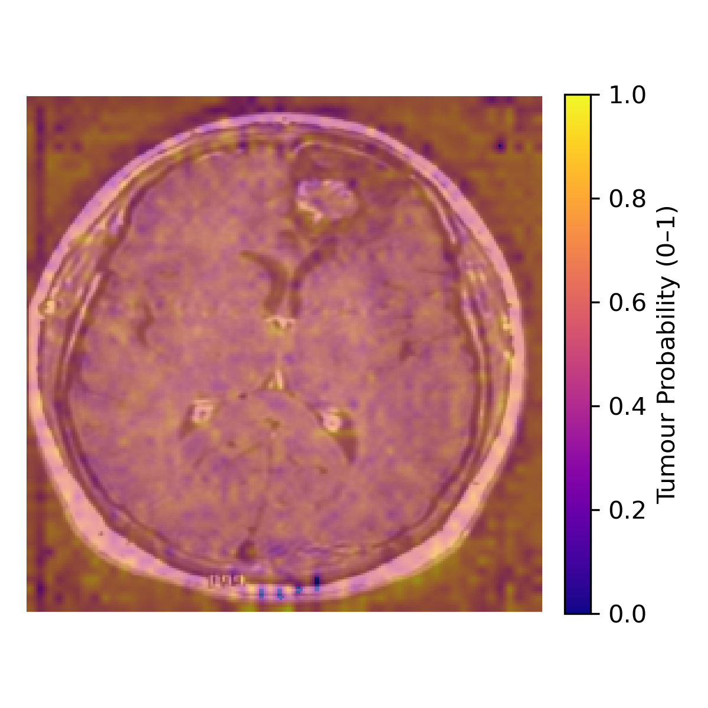

# 🧠 Brain Tumor Detection using Swin-UNet

This is a simple, fully local deep learning pipeline for **detecting and segmenting brain tumors** in MRI images using the **Swin-UNet architecture**. It requires no cloud setup or APIs — everything runs on your own machine!

---

## 📂 Dataset

- Total images: **253 MRI scans**
- Folder structure:
  - `yes/` → Tumor present
  - `no/` → No tumor

---

## 🧠 Model Architecture

- **Swin-UNet**: Combines U-Net with Swin Transformers for better spatial and global understanding.
- Performs:
  - **Binary classification** (Tumor / No-Tumor)
  - **Segmentation** (pixel-wise tumor localization)
- Outputs include **classification metrics** and **heatmap overlays**

---

## 📊 Evaluation Results

| Metric     | Score |
|------------|-------|
| Accuracy   | 0.98  |
| Precision  | 0.97  |
| Recall     | 0.98  |
| F1 Score   | 0.98  |

---

## 🖼️ Example Output


---

## 🛠️ How to Run

```bash
# Install dependencies
pip install -r requirements.txt

# Train the model
python train.py

# Evaluate the model
python evaluate.py

# Generate heatmap
python overlay.py


